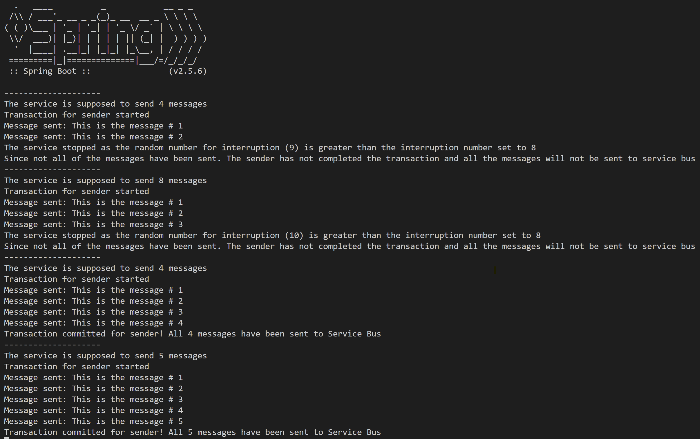

# java-transaction-on-same-entity

This repository has two samples that demonstrate the usage of Transactions in Service Bus with Java:

- [SingleEntityTransactionService.java](/code/src/main/java/com/jorgecupi/java/singleentitytransaction/service/SingleEntityTransactionService.java) - That sends and receives a single message through the same topic using Transactions for both the sender and receiver.
- [MultipleMessagesSingleEntityTransactionService.java](/code/src/main/java/com/jorgecupi/java/singleentitytransaction/service/MultipleMessagesSingleEntityTransactionService.java) - It is a service that, every 10 seconds, randomly tries sends 1-10 messages to Service Bus and can randomly interrupted. If the sending of the messages is not completed due to the random interruption then the sender does not commit the transaction and all of the messages are not sent into Service Bus.

## Detailing the Multiple Message sample

```java
    private int ceilingForInterruptionNumber = 11;
    private int interruptionNumber = 8;
```

The **ceilingForInterruptionNumber** and **interruptionNumber** variables are connected.

The idea is that a **randomNumberForInterruption** should be generated every time that a new message wants to be sent. Its value ranges from **0** to **ceilingForInterruptionNumber** and if
 its value is greater than the **interruptionNumber** then the service is interrupted.

```java
@Scheduled(fixedDelay = 10000)
public void singleTransactionHandler() throws InterruptedException {
// Code here
}
```

The @Scheduled annotation helps us iterate this service every *X* miliseconds detailed at the **fixedDelay** property.

```java
var transactionForSender = senderClient.createTransaction();
```

The line above is the one on charge to actually create a Transaction and not allow any message to be sent into Service Bus *until* the

```java
senderClient.commitTransaction(transactionForSender);
```

**commitTransaction** method is called.

In this example, the **commitTransaction** method is only called if there was no interruption during the sending of the messages.

```java
while(i <= randomNumber) {
    // Code to send the message happening here
    // ...

    int randomNumberForInterruption = new Random().nextInt(ceilingForInterruptionNumber);
    if(randomNumberForInterruption > interruptionNumber) {
        System.out.println(String.format(SERVICE_STOPPED, randomNumberForInterruption, interruptionNumber));
        interruptionOnPurposeHappened = true;
        break;
    }
}

if(!interruptionOnPurposeHappened) {
    senderClient.commitTransaction(transactionForSender); 

    System.out.println(String.format(TRANSACTION_COMMITTED, randomNumber));
} else {
    System.out.println(TRANSACTION_NOT_COMMITTED);
}
```

This are the lines that **might** cause a wanted interruption at the sample to demonstrate that the **Transaction** property from Service Bus works. IF, the **interruptionOnPurposeHappened** is set to **true** then the transaction will not be committed.

Below you can see a screenshot of the sample working:



As the image can tell, there were four runs of the service:

- First run with 4 messages to be sent: The service stopped at the second message and no message was sent to Service Bus
- Second run with 8 messages to be sent: The service stopped at the third message and no message was sent to Service Bus
- Third run with 4 messages to be sent: The service did not stop and all messages were sent to Service Bus
- Fourth run with 5 messages to be sent: The service did not stop and all messages were sent to Service Bus
